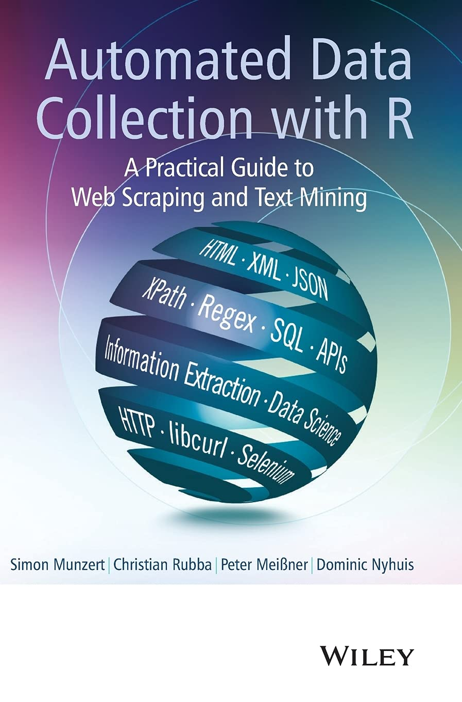

```{r install, echo = F}
# install.packages("rmarkdown")
# install.packages("tidyverse")
# install.packages("qrcode")

library(tidyverse)
library(rmarkdown)
library(qrcode)
library(rvest)
library(xml2)
```

------------------------------------------------------------------------

## About me :wave:

-   Post-doctoral Researcher
-   Witten/Herdecke University
-   Focus on computational social science and political behavior
-   Part of [zweitstimme.org](https://zweitstimme.org/) project

------------------------------------------------------------------------

## About you

-   Experience with **R** vs. **Python**?
-   Experience with **agentic coding** (e.g. Claude Code, Cursor, GitHub Copilot, etc.)?
-   Experience with **web scraping**?
    -   If yes: what did you scrape (site/API), and with what tools (e.g. `rvest`, Selenium, `httr`)?

------------------------------------------------------------------------

## Why Web Scraping?

-   Access to unique and innovative data sources
-   Create **original datasets** that do not exist in ready-to-use form
-   Large amounts of data openly accessible
-   Different content types (e.g. text, metadata, images)
-   Complementing traditional research methods

## Research Examples (1/3)

::: small-font
-   [ⓘ]{.info-tip data-tip="Uses experiments on the Arab Twittersphere plus a survey experiment to test counter-speech messages and measure changes in online hate speech"} **#No2Sectarianism: Experimental Approaches to Reducing Sectarian Hate Speech Online** ([Siegel & Badaan 2020](https://doi.org/10.1017/S0003055420000283))
-   [ⓘ]{.info-tip data-tip="Combines cross-platform data (Twitter and Gab accounts for the same users) to show how deplatforming on mainstream platforms can shift activity and increase hate-speech engagement elsewhere"} **Banned: How Deplatforming Extremists Mobilizes Hate in the Dark Corners of the Internet** ([Mitts 2021](https://www.dropbox.com/s/iatnxn5gtq48fxu/Mitts_banned.pdf?dl=1))
-   [ⓘ]{.info-tip data-tip="Links administrative data on radio license applications and election outcomes to estimate how control of local media affects electoral success"} **Controlling the Airwaves: Incumbency Advantage and Community Radio in Brazil** ([Boas & Hidalgo 2011](https://doi.org/10.1111/j.1540-5907.2011.00532.x))
-   [ⓘ]{.info-tip data-tip="Web-scrapes and geocodes a large archive of local campaign activities from an online platform to study the effects of grassroots mobilization"} **Place-Based Campaigning: The Political Impact of Real Grassroots Mobilization** ([Bischof & Kurer 2023](https://doi.org/10.1086/723985))
-   [ⓘ]{.info-tip data-tip="Uses millions of campaign-finance records to map collaboration networks and show how resource sharing relates to institutional power"} **I Get By with a Little Help from My Friends: Leveraging Campaign Resources to Maximize Congressional Power** ([Box-Steffensmeier et al. 2020](https://doi.org/10.1111/ajps.12528))
:::

------------------------------------------------------------------------

## Research Examples (2/3)

::: small-font
-   [ⓘ]{.info-tip data-tip="Builds a large text corpus of legislative session transcripts and applies topic modeling to measure how reform-induced reelection incentives shift legislative focus over time"} **Electoral Accountability and Particularistic Legislation: Evidence from an Electoral Reform in Mexico** ([Motolinia 2021](https://doi.org/10.1017/S0003055420000672))
-   [ⓘ]{.info-tip data-tip="Combines referendum outcomes and surveys to estimate how a major real-world event shifted support for local police spending, with heterogeneity across places"} **Defund My Police? The Effect of George Floyd’s Murder on Support for Local Police Budgets** ([Sances 2023](https://doi.org/10.1086/723979))
-   [ⓘ]{.info-tip data-tip="Continuously collects website content and HTTP status codes to detect DoS attacks and links attack timing to what outlets publish"} **Hot topics: Denial-of-Service attacks on news websites in autocracies** ([Lutscher 2021](https://doi.org/10.1017/psrm.2021.68))
-   [ⓘ]{.info-tip data-tip="Example of building research infrastructure by systematically collecting and standardizing parties’ press releases across countries (large-scale web data collection)"} **The PARTYPRESS Database** (Erfort, Klüver & Stötzer 2023)
-   [ⓘ]{.info-tip data-tip="Links administrative reentry records to household/neighborhood voting histories to test whether a salient ballot initiative mobilized communities most affected by incarceration"} **Turnout and Amendment Four: Mobilizing Eligible Voters Close to Formerly Incarcerated Floridians** ([Morris 2021](https://doi.org/10.1017/S0003055421000253))
:::

------------------------------------------------------------------------

## Research Examples (3/3)

::: small-font
-   [ⓘ]{.info-tip data-tip="Uses a corpus of 120,000 party press releases (2013–2017) to track issue attention and positions during the refugee crisis"} **How the refugee crisis and radical right parties shape party competition on immigration** ([Gessler & Hunger 2022](https://doi.org/10.1017/psrm.2021.64))
-   [ⓘ]{.info-tip data-tip="Builds an original collection of Twitter data from pro-government bots to test whether bots react more to online vs. offline opposition activity"} **Why Botter: How Pro-Government Bots Fight Opposition in Russia** ([Stukal et al. 2022](https://doi.org/10.1017/S0003055421001507))
-   [ⓘ]{.info-tip data-tip="Combines administrative data on local health facility closures with panel survey data to estimate how service decline shifts political attitudes and voting intentions"} **Public Service Decline and Support for the Populist Right: Evidence from England’s National Health Service (NHS)** ([Dickson, Hobolt, De Vries & Cremaschi forthcoming](http://catherinedevries.eu/NHS.pdf))
-   [ⓘ]{.info-tip data-tip="Uses an LLM annotation pipeline on ~1M German police press releases (2014–2024) to study how out-group cues in police communications respond to immigration salience shocks and election periods"} **The Police as Gatekeepers of Information: Immigration Salience and Selective Crime Reporting** ([Elshehawy et al. 2025](https://osf.io/preprints/socarxiv/trhys_v1))
:::

------------------------------------------------------------------------

## Workshop Goals

1.  Basics of web scraping
2.  Explore different methods of webscraping
3.  Learn about practical applications of web scraping
4.  Build a reproducible scraping pipeline
5.  Understand the role of AI agents in scraping workflows

## What’s new in 2026: AI-assisted scraping

-   AI tools have improved significantly
-   They can now often draft a working scraper quickly, propose selectors/regex, and iterate on errors.
-   This workshop still focuses on **understanding the web** (HTML, APIs, dynamic content).

------------------------------------------------------------------------

## Organizational Points

-   Workshop logistics
-   Github
-   Syllabus

```{r github}
qr_code("https://github.com/cornelius-erfort/automated-web-data-collection-2026") %>% plot
```

<https://github.com/cornelius-erfort/automated-web-data-collection-2026>

------------------------------------------------------------------------

## Resources (1/2)

::::: columns
::: {.column width="70%"}
Munzert, S., Rubba, C., Meißner, P., & Nyhuis, D. (2014). Automated Data Collection with R: A Practical Guide to Web Scraping and Text Mining. Wiley.
:::

::: {.column width="30%"}
{width="80%"}
:::
:::::

------------------------------------------------------------------------

## Resources (2/2)

::::: columns
::: {.column width="70%"}
Wickham, H., & Grolemund, G. (2023). R for Data Science (2nd Edition). O'Reilly Media.
:::

::: {.column width="30%"}
{width="80%"}
:::
:::::

------------------------------------------------------------------------

## Timeline (1/2)

-   Day 1 Topics
    -   Web data decision framework: HTML vs API vs dynamic content
    -   HTML and CSS essentials for scraping with `rvest`
    -   API fundamentals: query parameters, pagination, and responses
    -   Build a minimal reproducible scraper workflow
    -   Data quality checks before analysis
    -   Applied exercise block

------------------------------------------------------------------------

## Timeline (2/2)

-   Day 2 Topics
    -   Dynamic pages and browser automation (when and how)
    -   Robust scraping: retries, logging, and anti-fragile selectors
    -   Workflow operations: file management, scheduling, and monitoring
    -   Ethics and legal practice for responsible collection
    -   AI-assisted scraping with verification guardrails
    -   Applied exercise block

------------------------------------------------------------------------

## Questions

-   Any questions?
-   Feel free to interrupt me at any point

------------------------------------------------------------------------

## Where Can Web Data Come From?

-   **Raw websites (HTML):** content in page elements, links, and tables
-   **APIs:** structured responses (often JSON) designed for data exchange
-   **Datasets/downloads:** files like CSV, Excel, PDF, or ZIP provided on websites
-   In practice, we first identify the source type, then choose the right collection strategy.

------------------------------------------------------------------------

## How is Data Ordered on the Web?

-   We need to have a basic understanding of how websites work.
-   If we can read that structure, we can reliably target and extract the right pieces of information.
-   So before scraping at scale, we start with the basics of **HTML** and **CSS selectors**.

------------------------------------------------------------------------

# HTML and Web Structure

## HTML

-   HyperText Markup Language
-   Building blocks of most websites
-   Defines the structure and content of a webpage
-   Uses tags to define elements (e.g. headings, paragraphs, links, images)
-   Tags are enclosed in angle brackets (e.g. `<tagname>content</tagname>`)
-   Tags can have attributes (e.g. ``)
-   Also helps us find the information we want!

------------------------------------------------------------------------

## HTML Syntax

-   [The World Wide Web project (CERN, early web)](http://info.cern.ch/hypertext/WWW/TheProject.html)
-   [Space Jam (1996 website)](https://www.spacejam.com/1996/)

------------------------------------------------------------------------

## HTML Syntax

``` {.html code-line-numbers="|1,16|2-4|5,15|6|7|8|9-13|14"}
<html>
<head>
  <title>The World Wide Web project</title>
</head>
<body>
  <h1>World Wide Web</h1>
  <p>The WorldWideWeb (W3) is a wide-area hypermedia information retrieval initiative.</p>
  <h2>What's out there?</h2>
  <ul>
    <li><a href="/hypertext/DataSources/Top.html">Pointers to online information</a></li>
    <li><a href="/hypertext/WWW/Help.html">Help</a> on the browser you are using</li>
    <li><a href="/hypertext/WWW/Status.html">Software products</a></li>
  </ul>
  <p><a href="/hypertext/WWW/People.html">People</a> | <a href="/hypertext/WWW/History.html">History</a> | <a href="/hypertext/WWW/FAQ/List.html">FAQ</a></p>
</body>
</html>
```

-   Open in browser: [HTML example (plain)](examples/html-syntax-plain.html)

------------------------------------------------------------------------

## From Structure to Design

-   What if we want to add color etc.?
-   This makes updates hard.
-   Design usually follows rules (e.g. body text gray, headings blue, links underlined).
-   We need a language to define these design rules separately.
-   Result: cleaner code, easier maintenance, and faster redesigns.
-   Open in browser: [HTML example (styled)](examples/html-syntax-styled.html)

------------------------------------------------------------------------

## CSS

-   Cascading Style Sheets
-   Used to style HTML elements
-   Defines how HTML elements should be displayed on the screen
-   Can be used to change colors, fonts, layouts, and more
-   CSS rules consist of selectors and declarations
-   Selectors target HTML elements, and declarations define the styles to be applied

. . .

-   *Same logic helps us find the information we want!*

------------------------------------------------------------------------

## Using CSS in HTML

. . .

``` {.html code-line-numbers="3|7|8|10"}
<html>
<head>
<link rel="stylesheet" href="mystyle.css">
</head>
<body>
  <h1 id='first'>A heading</h1>
  <p class = "main-text">Some text &amp; <b>some bold text.</b></p>
  <p>This is a <a href="https://www.google.com" class = "important-link">Link</a></p>
  <div>
    <p id = "twitter">Follow us on Twitter.</p>
  </div>
</body>
```

------------------------------------------------------------------------

## CSS Syntax

``` {.html code-line-numbers="1-4|6-9|11-14|16-19"}
h1 {
  color: blue;
  font-size: 24px;
}

div p {
  color: red;
  font-size: 20px;
}

.important-link {
  color: green;
  font-size: 18px;
}

#twitter {
  color: orange;
  font-size: 16px;
}
```

------------------------------------------------------------------------

## CSS path

-   `elements` are referred to by their name, e.g. `p`

. . .

-   Elements within other elements can be referred to: `div p`

. . .

-   The `class` attribute is referred to with a dot, e.g. `.important-link`

. . .

-   The `id` attribute is referred to with a hash, e.g. `#twitter`

------------------------------------------------------------------------

## CSS Diner

```{r css}
qr_code("https://flukeout.github.io/") %>% plot
```

10-15 min (including break)

<https://flukeout.github.io/>

------------------------------------------------------------------------

## View the source code in the browser

[MPs from the 17th Bundestag](https://webarchiv.bundestag.de/archive/2013/1212/bundestag/abgeordnete17/alphabet/index.html), CSS path: `.linkIntern`

```{r bundestag}
qr_code("https://webarchiv.bundestag.de/archive/2013/1212/bundestag/abgeordnete17/alphabet/index.html") %>% plot
```

<https://webarchiv.bundestag.de/archive/2013/1212/bundestag/abgeordnete17/alphabet/index.html>

------------------------------------------------------------------------

## View the source code in the browser

[Political scientists on Wikipedia](https://en.wikipedia.org/wiki/List_of_political_scientists), CSS path: `h2+ ul li > a:nth-child(1)`

```{r polsci}
qr_code("https://en.wikipedia.org/wiki/List_of_political_scientists") %>% plot
```

<https://en.wikipedia.org/wiki/List_of_political_scientists>

------------------------------------------------------------------------

## Selector Gadget

```{r selector}
qr_code("https://selectorgadget.com") %>% plot
```

10-15 min to install

<https://selectorgadget.com>

------------------------------------------------------------------------

## From Page Structure to Data Extraction in R

-   We now know how to inspect HTML and identify CSS selectors.
-   Next step: use R packages to parse/load pages and extract the elements we want.
-   Workflow: `read_html()` -\> select elements -\> extract text/attributes -\> build dataset.

------------------------------------------------------------------------

## Package `xml2`

-   `read_html()`

. . .

-   `read_html("http://rvest.tidyverse.org/")`

. . .

-   `read_html("myfiles/myhtml.html")`

------------------------------------------------------------------------

## Package `rvest`

-   `html_elements(html, css = "your css path")` gives you the elements that fit to your css path

. . .

-   `html_text2(html)` gives you the content/text of the elements

. . .

-   `html_attr(html, name = "name of the html attribute")` gives you the values/texts of the html attribute

------------------------------------------------------------------------

## Exercise 1: HTML

-   **Time:** 15-20 minutes
-   **Where in GitHub:** `exercises/01-html.R`
-   **Goal:** inspect webpage and extract elements with CSS selectors
-   **Steps:**
    1.  Open `exercises/01-html.R`
    2.  Run the starter code and inspect the page structure
    3.  Write selectors and extract text/attributes
    4.  Compare your output with your neighbor

------------------------------------------------------------------------

## Scraping HTMLs

What we did so far:

-   Download single HTML
-   Extract data from HTML

But:

-   Data is often on multiple pages

------------------------------------------------------------------------

## Basic HTML web scraping workflow

First step

```{mermaid}
flowchart LR
  A(URL)-- "read_html(URL)" --> B(HTML file)
  B -- "rvest/regex" --> C(Data)
  B -- "rvest" --> D(list of URLs)
```

or

```{mermaid}
flowchart LR
  A(URL)-- "manually" --> B(URL pattern)
  B -- "str_c(URL, pattern)" --> C(list of URLs)
```

------------------------------------------------------------------------

## Manipulating URLs

-   Often, the URLs for the HTMLs we need follow a pattern:

`https:///website.com/page/1`, `https:///website.com/page/2`, ...

-   We can use `stringr` to create a vector of URLs we want to download.

```{r echo = T}
str_c("https:///website.com/page/", 1:10)

```

------------------------------------------------------------------------

## Manipulating URLs

```{r }
qr_code("https://labour.org.uk/category/latest/press-release") %>% plot
```

<https://labour.org.uk/category/latest/press-release>

## Collecting links from HTML

-   We can use `rvest` to extract links from HTMLs (href attribute)

```{r echo = T}
#| code-line-numbers: "1,2|3,4|5,6|7,8|9,10"
# Download the page that lists recent press releases
myhtml <- read_html("https://labour.org.uk/category/latest/press-release")
# Select all relevant link elements with a CSS selector
myelements <- html_elements(myhtml, ".post-preview-compact__link")
# Extract the href attribute (relative URLs)
links <- html_attr(myelements, "href")
# Turn relative paths into absolute URLs
links <- str_c("https://labour.org.uk", links)
# Check the first few collected links
head(links, 5)

```

## How do we download multiple HTMLs?

-   For loop
-   (`sapply()`)
-   (While loop)

## For loop

```{r echo = T, eval = T}
vector <- 1:3
for (element in vector) {
  print(element)  
}

```

. . .

```{r echo = T}
for (element in c("one", "two", "three")) {
  print(element)  
}

```

## For loop

```{r echo = T, loop}
#| code-line-numbers: "1,2|3,14|4,5|6,7|8|9-11|12,13"
# Create a local folder once to store downloaded pages
if(!dir.exists("labour")) dir.create("labour")
for (link in head(links)) {
  # Build a filename from the URL slug
  filename <- str_c("labour/", basename(link), ".html")
  # Skip if this page was already downloaded
  if(file.exists(filename)) next
  print(filename)
  # Download page HTML and save it locally
  myhtml <- read_html(link)
  write_html(myhtml, file = filename)
  # Pause briefly to avoid overloading the server
  Sys.sleep(1)
}

```

## Pause R

For loops create a lot of traffic:

-   `Sys.sleep(seconds)` pauses R for the specified time
-   Be polite and pause for one or two seconds

## Manage files

-   The number of HTMLs can grow really fast.
-   We don't want to start from the beginning with every error.
-   Best practice: Save HTMLs to a local folder.

## Manage files

-   `list.files(folder, full.names = TRUE)` returns a vector with all files (and folders in the folder)
-   `file.exists(file)` returns TRUE when the file exists, otherwise FALSE
-   `dir.create(folder)`creates the folder
-   `dir.exists(folder)`returns TRUE when the folder exists, otherwise FALSE

## Manage files

```{r echo = T, eval = F}
for (link in links) {
  filename <- basename(link)
  if(!file.exists(filename)) next
  myhtml <- read_html(link)
  # ...
}
```

## Useful functions

-   `if(condition) expression`, if condition: only runs expression if condition is TRUE
-   `!` Logical NOT operator\`, inverts a logical (`TRUE` -\> `FALSE`, `FALSE` -\> `TRUE`)
-   `vector_1 %in% vector_2` operator to check whether the elements from vector_1 are in vector_2
-   `message` prints a message in the console

------------------------------------------------------------------------

## Exercise 2: Web Scraping

-   **Time:** 20-25 minutes
-   **Where in GitHub:** `exercises/02-webscraping.R`
-   **Goal:** scrape pages, store HTMLs, and combine info
-   **Steps:**
    1.  Open `exercises/02-webscraping.R`

    2.  Build or inspect the URL list you need to scrape

    3.  Loop over pages with a polite pause (`Sys.sleep`)

    4.  Save files locally and skip existing files

    5.  Extract and combine key fields into one tidy table

------------------------------------------------------------------------

## Beyond HTML: Other Web Data Sources

-   Data is not always in visible HTML elements.
-   Common alternatives:
    -   **APIs** (often JSON)
    -   **Direct files** (CSV, XLSX, PDF, ZIP)
    -   **Other formats** (XML, GeoJSON, feeds)
-   First identify the source type, then choose the right method.
-   Next, we focus on APIs as a fast and robust option.

------------------------------------------------------------------------

## APIs

-   Efficient and structured way to provide data
-   Application Programming Interfaces
-   ("Hidden" APIs)

## APIs

-   Standardized way to request data
-   API returns only the requested data
-   Some APIs are free
-   Some APIs require authentication

## Example API

Example URL: <https://archive-api.open-meteo.com/v1/archive?latitude=54.09&longitude=12.14&start_date=2020-05-16&end_date=2020-05-20&daily=temperature_2m_max>

``` {.bash code-line-numbers="|1|2|3|4|5|6"}
https://archive-api.open-meteo.com/v1/archive?
latitude=54.09&
longitude=12.14&
start_date=2020-05-16&
end_date=2020-05-20&
daily=temperature_2m_max
```

## API Query Parameters

-   **latitude**: The latitude of the location for which you want weather data (e.g., `54.09`)

-   **longitude**: The longitude of the location (e.g., `12.14`)

-   **start_date**: The beginning date for the data (format: `YYYY-MM-DD`)

-   **end_date**: The end date for the data (format: `YYYY-MM-DD`)

-   **daily**: The daily variable(s) you want, e.g., `temperature_2m_max`

-   You can change these parameters to get data for different locations, dates, or variables.

## API Query Parameters

```{r open-meteo-docs-qr}
qr_code("https://open-meteo.com/en/docs") %>% plot
```

[Open-Meteo API Documentation](https://open-meteo.com/en/docs)

## API response example

<https://archive-api.open-meteo.com/v1/archive?latitude=54.09&longitude=12.14&start_date=2020-05-16&end_date=2020-05-20&daily=temperature_2m_max>

``` {.html code-line-numbers="|1-2|12-15"}
{"latitude":54.100006,
"longitude":12.100006,
"generationtime_ms":0.27310848236083984,
"utc_offset_seconds":0,
"timezone":"GMT",
"timezone_abbreviation":"GMT",
"elevation":13.0,
"daily_units":
  {"time":"iso8601",
  "temperature_2m_max":"°C"},
"daily":
  {"time":
      ["2020-05-16","2020-05-17","2020-05-18","2020-05-19","2020-05-20"],
  "temperature_2m_max":
      [14.0,16.4,13.6,16.0,15.1]}}
```

## APIs: More examples

-   Geographic coordinates
-   Twitter data
-   Uber price estimation

## Hidden APIs

-   Many websites load data from APIs in the background.
-   You can often find these calls in browser DevTools (`Network` -\> `Fetch/XHR`).
-   Advantage: cleaner and more structured data than scraping rendered HTML.
-   Typical workflow:
    1.  Open page and inspect `Network` requests
    2.  Find endpoint, parameters, and required headers
    3.  Reproduce request in R (`httr::GET()`)
    4.  Parse response (`jsonlite::fromJSON()`)

## APIs more examples

List of free APIs

```{r }
qr_code("https://github.com/public-apis/public-apis") %>% plot
```

<https://github.com/public-apis/public-apis>

## R packages for APIs

-   Often R packages make it easier to use APIs in R

List of R packages

```{r }
qr_code("https://gist.github.com/zhiiiyang/fc19995f7e350f3c7fb940757f6213cf#file-apis-md") %>% plot
```

<https://gist.github.com/zhiiiyang/fc19995f7e350f3c7fb940757f6213cf#file-apis-md>

## File formats

Which file formats do we need to know?

. . .

-   XML `xml2::read_xml()`
-   CSV `readr::read_csv()`
-   XLSX `openxlsx::read.xlsx()`
-   JSON

. . .

But also:

-   PDF
-   JPG etc.

## JSON

-   Data are stored in key-value pairs: `{"key": "value"}`
-   JSON is hierarchical, unlike tables/dataframes
-   Curly brackets `{}` define objects (*unordered*)
-   Square brackets `[]` define arrays (*ordered*)

## JSON: Objects vs Arrays

``` {.json code-line-numbers="|1-4|6-10|12-15"}
{
  "city": "Rostock",
  "country": "Germany"
}

[
  {"year": 2022, "temperature_2m_max": 19.1},
  {"year": 2023, "temperature_2m_max": 18.7},
  {"year": 2024, "temperature_2m_max": 19.4}
]

{
  "metadata": {"source": "open-meteo"},
  "daily": [{"date": "2020-05-16", "temperature_2m_max": 14.0}]
}
```

## JSON Example

``` {.html code-line-numbers="|1,18|2,17|3-13|6-9|14-16"}
{"indy movies" :
  [
    {
    "name" : "Raiders of the Lost Ark",
    "year" : 1981,
    "actors" : {
        "Indiana Jones": "Harrison Ford",
        "Dr. Rene Belloq": "Paul Freeman"
      },
    "producers": ["Frank Marshall", "George Lucas", "Howard Kazanjian"],
    "budget" : 18000000,
    "academy_award_ve": true
    },
    {
    "name" : "Another Movie"
    }
  ]
}
```

## JSON in R

```{r echo = T, eval = T}
library(jsonlite)
json <- '{"indy movies" :[
  {"name" : "Raiders of the Lost Ark",
  "year" : 1981,
  "actors" : {
      "Indiana Jones": "Harrison Ford",
      "Dr. Rene Belloq": "Paul Freeman"}},
{"name" : "Another Movie",
"year" : 1999
}]}'
  
fromJSON(json)
```

## Hierarchical data

-   Our analysis tools (dataframes, models, plots) usually expect **rectangular data**.
-   JSON is often **hierarchical**: nested objects, arrays, lists.
-   Problem: there is no single automatic "correct" flattening.
-   We need to decide what should become:
    -   columns (attributes of one unit),
    -   rows (repeated units),
    -   separate tables (one-to-many relationships).

. . .

-   Typical tools:
    -   add columns: `tidyr::unnest_wider()`
    -   add rows: `tidyr::unnest_longer()`

## Hierarchical data

-   Practical workflow:
    1.  Parse JSON (`jsonlite::fromJSON()` or `jsonlite::parse_json()`)
    2.  Inspect structure (`str()`, `names()`)
    3.  Flatten step by step with `tidyr`
    4.  Check that rows still represent the intended unit of analysis
-   Core packages: `jsonlite` and `tidyr`

------------------------------------------------------------------------

## Exercise 3: APIs and Data Formats

-   **Time:** 20-25 minutes
-   **Where in GitHub:** `exercises/03-apis.R`
-   **Goal:** request API data, parse JSON, and transform nested output into rectangular data
-   **Steps:**
    1.  Open `exercises/03-apis.R`
    2.  Build and run an API request URL
    3.  Parse response with `jsonlite`
    4.  Export a clean table for analysis

------------------------------------------------------------------------

::: ::::::::
:::
